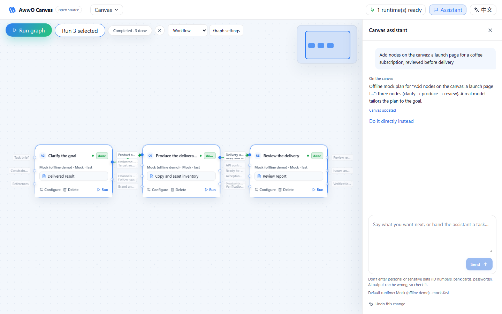

# AwwO Canvas

The open-source edition of **AwwO**'s agent canvas: an infinite canvas of agent nodes with typed
input/output contracts, an orchestrator that plans, routes and runs them, and a small HTTP
protocol through which any agent engine plugs in, and unplugs, while everything keeps running.

> **中文简介**：AwwO Canvas 是 AwwO 智能体画布的开源版。它开放三部分：**画布框架**（文档模型、
> 类型化端口连线、输入输出契约、整图运行、互审 Graph、节点团队）、**编排 skill**（画布规划、
> 助手路由、节点交付格式、团队协作四种模式，全部是可热更新的 Markdown）、**热插拔执行器架构**
> （任何实现 worker 协议的进程都能随时接入或拔出，已开始的运行不会被中途换引擎）。
> 自带离线 Mock 执行器，不配置任何模型也能把整条链路跑通。设计思路见
> [docs/design.zh-CN.md](docs/design.zh-CN.md)。



## What is inside

| Part | Where | What it does |
| --- | --- | --- |
| Canvas framework | `packages/core`, `apps/web/src/canvas` | The document model, typed ports and wires, contracts, the closed plan protocol, graph execution, review graphs and node teams. Taken from AwwO, with AwwO's own tests. |
| Orchestration skills | `skills/*/SKILL.md` | Every prompt the orchestrator sends: the canvas planner, the assistant router, node delivery formats and team collaboration. Edit a file and the next call uses it. |
| Orchestrator | `apps/server` | Routes each assistant message (plan or execute), streams plans, runs graphs and node teams, and owns the hot-plug runtime registry. |
| Runtimes | `workers/`, `runtimes.json` | Reference workers: an offline **mock**, an **OpenAI-compatible** worker for any Chat Completions API, and a standard-library **Python** worker. |

## Quick start

Requires Node.js 22.12 or newer.

```bash
git clone https://github.com/Boxpo/awwo-canvas.git
cd awwo-canvas
npm install
npm run dev
```

Open [http://127.0.0.1:5173](http://127.0.0.1:5173). `npm run dev` starts the mock worker (`:8791`),
the orchestrator (`:8787`) and the canvas dev server (`:5173`), all bound to `127.0.0.1`. Ask the
assistant for something ("在画布上搭建：咖啡订阅上线页面，撰写后由评审验收"), or load an example from
the **Canvas** menu, then press **Run graph**. The mock answers in the exact shape of every node's
output contract, so plans, graph runs, review loops and teams all complete offline.

One process instead of three, the way you would run it on a machine:

```bash
npm run build          # builds the canvas into apps/web/dist
npm run worker:mock    # in one terminal
npm start              # in another: canvas and API on http://127.0.0.1:8787
```

### Use a real model

The OpenAI-compatible worker speaks to OpenAI, vLLM, Ollama, LM Studio, one-api/new-api relays and
other Chat Completions endpoints. Its key stays in the worker process; the orchestrator and the
browser never see it.

```bash
# macOS / Linux
AWWO_OPENAI_API_KEY=sk-... AWWO_OPENAI_BASE_URL=https://api.openai.com/v1 AWWO_OPENAI_MODELS=gpt-4.1-mini npm run dev
```

```powershell
# Windows PowerShell
$env:AWWO_OPENAI_API_KEY = "sk-..."; $env:AWWO_OPENAI_MODELS = "gpt-4.1-mini"; npm run dev
```

Then choose the `openai` runtime on a node, or make it the default for everything:
`AWWO_DEFAULT_RUNTIME=openai`, `AWWO_PLANNER_RUNTIME=openai`, `AWWO_ROUTER_RUNTIME=openai`.
Every variable is listed in [.env.example](.env.example).

## How it fits together

```text
 browser · apps/web                 orchestrator · apps/server                 workers · any language
┌──────────────────────────┐ /api ┌──────────────────────────────────┐ protocol v1 ┌──────────────────┐
│ canvas document           │─────▶│ assistant router  (plan|execute)  │────────────▶│ mock             │
│ (@awwo/core)              │ SSE  │ planner · graph runs · teams      │ GET /health │ openai-compatible│
│ plan → validate → apply   │◀─────│ review loop · direct runs         │ POST /runs  │ python-minimal   │
│ as ONE undo step          │      │ runtime registry  (hot-plug)      │ SSE events  │ your engine      │
└──────────────────────────┘      │ skills/*.md       (hot-reload)    │             └──────────────────┘
                                   └──────────────────────────────────┘
```

- **The document is the source of truth.** Nodes, wires, contracts and the review policy live in
  one canvas document in the browser. The planner only *proposes* operations from a closed
  protocol; the canvas validates them against the current document and applies them as a single
  undoable change, or reports the proposal stale if the canvas moved meanwhile.
- **The orchestrator owns runs.** A graph run gets a frozen copy of the document, resolves every
  node's runtime and model at admission, and streams numbered events, so a reload or a dropped
  connection resumes where it left off.
- **Workers are processes, not SDKs.** The orchestrator links no agent SDK. It routes each model
  call to the worker named by the node's runtime over a four-endpoint HTTP protocol.

The full design, and why each rule exists, is in [docs/design.md](docs/design.md).

## Hot-plug runtimes

A runtime is any process that speaks [worker protocol v1](packages/core/src/protocol.ts):

| Endpoint | Purpose |
| --- | --- |
| `GET /health` | The catalog: models, input budgets, reasoning-effort levels, tools, capacity |
| `POST /internal/runs` | One model call, streamed as `text_delta` / `reasoning` / `completed` / `failed` / `cancelled` events |
| `DELETE /internal/runs/{runId}` | Stop that call (idempotent) |
| `POST /internal/completions` | One-shot call, used by the assistant router |

Three ways to plug one in, none of which restarts anything:

1. List it in `runtimes.json`. The file is watched; edits apply immediately.
2. `POST /api/runtimes` with `{ "id", "url", "label"?, "token"? }`, or use **Runtimes → Plug in** in the canvas.
3. Start the worker with `AWWO_REGISTER_URL=http://127.0.0.1:8787` and it registers itself
   (`python workers/python-minimal/worker.py` also unregisters on exit).

The registry probes every worker, checks that its catalog is well formed and that it serves the
runtime id it was registered under, and marks it unavailable when it stops answering. A run keeps
the runtime and model it was admitted with: unplugging a worker never silently moves a running
node to another engine. To write your own worker, start from
[workers/mock/worker.mjs](workers/mock/worker.mjs) (dependency-free, about 260 lines) or
[workers/python-minimal/worker.py](workers/python-minimal/worker.py).

## Orchestration skills

| Skill | Used for |
| --- | --- |
| [canvas-planner](skills/canvas-planner/SKILL.md) | Turns a goal into a version-1 plan: nodes from seven role templates, contracts, wires and an optional review policy |
| [assistant-router](skills/assistant-router/SKILL.md) | Decides whether a message edits the canvas (`plan`) or is a task to do now (`execute`); explicit canvas wording is routed by rule, anything unclear falls back to `plan` |
| [node-delivery](skills/node-delivery/SKILL.md) | How a node must answer its output contract: one text field, keyed JSON, complete HTML, file references |
| [team-orchestration](skills/team-orchestration/SKILL.md) | Deterministic teams of 1-8 members inside one node: sequential, parallel, debate and review |

Each skill is Markdown with named `### block: <name>` sections. The orchestrator reloads a skill
when its file changes; runs that already started keep the text they were admitted with. A
required block that is missing stops the server at start-up rather than falling back to other
wording.

## Commands

| Command | |
| --- | --- |
| `npm run dev` | Mock worker + orchestrator + canvas dev server (the OpenAI worker too when a key is set) |
| `npm test` | Unit and integration tests for core, server, web and the workers |
| `npm run typecheck` | TypeScript across the workspace |
| `npm run build` | Production build of the canvas |
| `npm run smoke` | Offline end-to-end check: boots the real orchestrator with mock workers and drives the HTTP API the canvas uses |

## Security

AwwO Canvas is a single-user tool that spends model credentials through its workers.

- Every process binds to `127.0.0.1`. The orchestrator refuses a non-loopback bind unless
  `AWWO_API_TOKEN` is set, and then requires `Authorization: Bearer <token>` on `/api`.
- Writes from a foreign browser origin are refused, and the `Host` header is checked against the
  names the server answers to, which blocks DNS-rebinding pages.
- Worker URLs and tokens are orchestrator configuration only. They never enter a canvas document,
  an exported file or anything sent to the browser.
- HTML deliverables are previewed in a sandboxed iframe with no capabilities, under a strict CSP.

There are no user accounts. Do not expose the orchestrator to a network you do not control.

## Provenance and license

Cut from AwwO at upstream commit `9376e770` as a standalone repository; what came from where, and
what was changed on purpose, is listed in [NOTICE.md](NOTICE.md). MIT licensed, see [LICENSE](LICENSE).
